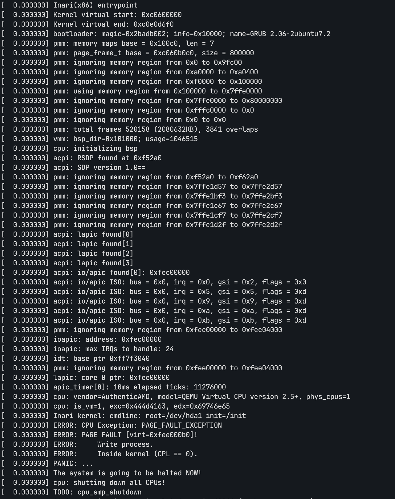

# Inari
Simple kernel written for i686 architecture

## Building
After running this command you'll get boot.iso file in the root folder (kernel ELF binary is located at build/Inari):

```shell
make build_kernel
```

You can run the following command to compile and run the kernel in the VM:

```shell
make test_serial
```

# Screenshots

