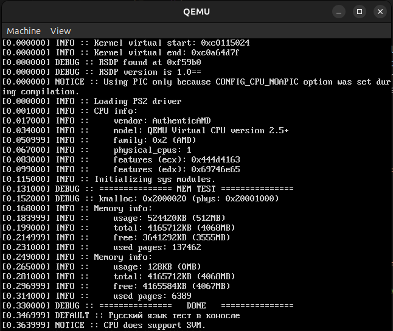

# Inari
Simple kernel written for x86 architecture (with potential support for x86-64).

## TODO
 - [ ] Complete ATA PIO driver.
 - [ ] FAT32 driver.
 - [ ] Improve memory allocation (VMM mainly).
 - [ ] Maybe userland someday?
 - [ ] Maybe after some decades implement our own bootloader without the need to use multiboot (or maybe rewrite lower kernel bootloader at least, because it sooo messy right now).
 - [ ] Fix some BUGs with APIC (does not start up for some reason).
 - [ ] Bring up all physical processors.

## Building
After running this command you'll get boot.iso file in the root folder (kernel ELF binary is located at build/Inari):

```shell
make build_kernel
```

You can run the following command to compile and run the kernel in the VM:

```shell
make run_debug
```

# Screenshots

