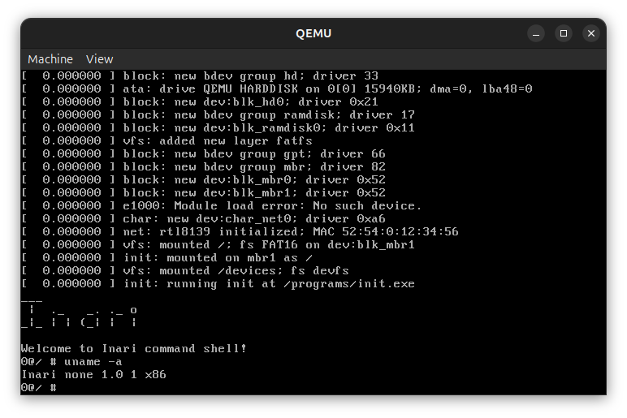

# Inari
I guess this is my 5th or so attempt on trying to create a kernel/OS. Seems like a successful one so far.

Simple OS with custom-made kernel and ring 3 userspace

## Building
To build the kernel simply run `make build`. This will generate file in `build/kernel.elf`, which can be booted with any multiboot compliant bootloader.

You can also build userspace apps by executing `./build.sh` in `binutils/` folder. This will also build custom libc for the userspace.

To build rootfs you can use `./mkimg.sh`, this will bundle all binutils, kernel file and install grub.

## Booting
You you can run the kernel via `qemu-system-i386 -serial stdio -hda build/boot.img -cpu 486` if constructing rootfs with `./mkimg.sh`.

You can also specify bootargs, which kernel will parse (e.g. by specifying in `grub.cfg`). Here are supported params:
 - earlycon: The earlycon device to print the early logs. Supported values: vga_text, pc8250.
 - root: The block dev to mount as root. Can be any block device in format %s%d, where %s is name and %d is index.
 - init: Path to the init script which will run as PID 1.

Example for bootargs: `earlycon=ga_text root=mbr0 init=/prog/cmd.exe`

## Hardware support
For now it only supports i686 systems, but support for other arches is planned in _some_ future. Nonetheless, here're currently supported devices.

 * ATA in PIO mode
 * PS/2 keyboard and Mouse
 * PC8250 serial and VGA text mode for console and earlycon
 * VBE/Vesa implementation

## Features
 * Multitasking and Scheduling.
 * Userspace with ring 3 and kernel threads in ring 0
 * Kernel modules with autoprobing
 * A Virtual File System (VFS) with devfs.
 * Partition parsing for both MBR and GPT.
 * A custom libc and basic userspace utilities.

## Screenshot

