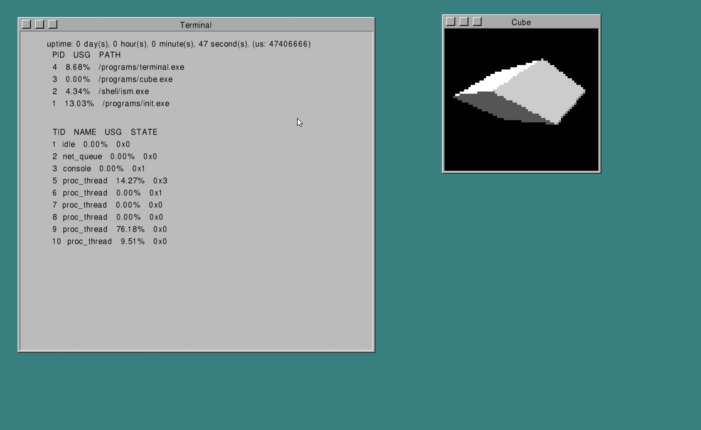

# Inari
A monolithic 32-bit x86 Operating System built from scratch.

Now in its third architectural iteration. The goal is to get to a sustainable working userspace, custom GUI, fully-featured network stack. Some of that work is being done currently.

> [!NOTE]  
 This kernel is not unix-based, not posix compliant. You _might_ get a feeling of otherwise, but frame it rather as getting things from different concepts I enjoy. E.g. not supporting forking and rather implementing spawing.

## Screenshots

## Building
To build the kernel simply run `make build`. This will generate file in `build/kernel.elf`, which can be booted with any multiboot compliant bootloader. The `make build` will also build the userspace programs.

To build rootfs you can use `./mkimg.sh`, this will bundle all apps, kernel file and install grub.

## Booting
You you can run the kernel via `qemu-system-i386 -serial stdio -cdrom build/boot.iso` if constructing rootfs with `./mkimg.sh`.

You can also specify bootargs, which kernel will parse (e.g. by specifying in `grub.cfg`). Here are supported params:
 - earlycon: The earlycon device to print the early logs. Supported values: vga_text, pc8250.
 - root: The block dev to mount as root. Can be any block device in format %s%d, where %s is name and %d is index.
 - init: Path to the init script which will run as PID 1.

Example for bootargs: `earlycon=vga_text root=mbr0 init=/programs/cmd.exe`

## Hardware support
For now it only supports i686 systems, but support for other arches is planned in _some_ future.
Here's currently supported hardware:
 * ATA in PIO mode
 * PS/2 keyboard and Mouse
 * PC8250 serial and VGA text mode for console and earlycon
 * VBE/Vesa implementation
 * PCI enumeration
 * RTL8139 driver

## Features
 * Multitasking and Scheduling.
 * Userspace with ring 3 and kernel threads in ring 0
 * Kernel modules with autoprobing
 * A Virtual File System (VFS) with devfs.
 * Partition parsing for both MBR and GPT.
 * A custom libc and basic userspace utilities.
 * Simple video/hid subsystem for common devices.
 * Simple network stack (Ethernet/IPv4/ARP/ICMP)

